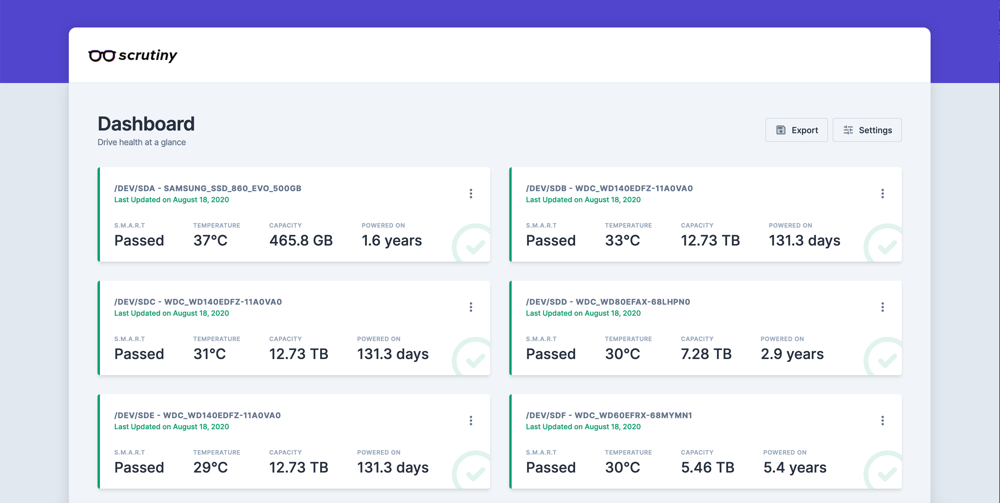

<p align="center">
  <a href="https://github.com/AnalogJ/scrutiny">
  
  </a>
</p>


# scrutiny

[](https://github.com/AnalogJ/scrutiny/actions?query=workflow%3ACI)
[](https://github.com/AnalogJ/scrutiny/blob/master/LICENSE)
[](https://godoc.org/github.com/analogj/scrutiny)
[](https://goreportcard.com/report/github.com/AnalogJ/scrutiny)
[](https://github.com/AnalogJ/scrutiny/releases)


WebUI for smartd S.M.A.R.T monitoring

> NOTE: Scrutiny is a Work-in-Progress and still has some rough edges.

[](https://imgur.com/a/5k8qMzS)

# Introduction

If you run a server with more than a couple of hard drives, you're probably already familiar with S.M.A.R.T and the `smartd` daemon. If not, it's an incredible open source project described as the following:

> smartd is a daemon that monitors the Self-Monitoring, Analysis and Reporting Technology (SMART) system built into many ATA, IDE and SCSI-3 hard drives. The purpose of SMART is to monitor the reliability of the hard drive and predict drive failures, and to carry out different types of drive self-tests.

Theses S.M.A.R.T hard drive self-tests can help you detect and replace failing hard drives before they cause permanent data loss. However, there's a couple issues with `smartd`:

- There are more than a hundred S.M.A.R.T attributes, however `smartd` does not differentiate between critical and informational metrics
- `smartd` does not record S.M.A.R.T attribute history, so it can be hard to determine if an attribute is degrading slowly over time.
- S.M.A.R.T attribute thresholds are set by the manufacturer. In some cases these thresholds are unset, or are so high that they can only be used to confirm a failed drive, rather than detecting a drive about to fail.
- `smartd` is a command line only tool. For head-less servers a web UI would be more valuable.

**Scrutiny is a Hard Drive Health Dashboard & Monitoring solution, merging manufacturer provided S.M.A.R.T metrics with real-world failure rates.**

# Features

Scrutiny is a simple but focused application, with a couple of core features:

- Web UI Dashboard - focused on Critical metrics
- `smartd` integration (no re-inventing the wheel)
- Auto-detection of all connected hard-drives
- S.M.A.R.T metric tracking for historical trends
- Customized thresholds using real world failure rates
- Temperature tracking
- Provided as an all-in-one Docker image (but can be installed manually)
- (Future) Configurable Alerting/Notifications via Webhooks
- (Future) Hard Drive performance testing & tracking

# Getting Started

## Docker

If you're using Docker, getting started is as simple as running the following command:

```bash
docker run -it --rm -p 8080:8080 \
-v /run/udev:/run/udev:ro \
-v /dev/disk:/dev/disk \
--name scrutiny \
--privileged analogj/scrutiny
```

- `/run/udev` and `/dev/disk` are necessary to provide the Scrutiny collector with access to your drive metadata.
- `--privileged` is required to ensure that your hard disk devices are accessible within the container (this will be changed in a future release)
- `analogj/scrutiny` is a omnibus image, containing both the webapp server (frontend & api) as well as the S.M.A.R.T metric collector. (see below)

### Hub/Spoke Deployment

In addition to the Omnibus image (available under the `latest` tag) there are 2 other Docker images available:

- `analogj/scrutiny:collector` - Contains the Scrutiny data collector, `smartctl` binary and cron-like scheduler. You can run one collector on each server.
- `analogj/scrutiny:web` - Contains the Web UI, API and Database. Only one container necessary

```bash
docker run -it --rm -p 8080:8080 \
--name scrutiny-web \
analogj/scrutiny:web

docker run -it --rm \
-v /run/udev:/run/udev:ro \
-v /dev/disk:/dev/disk \
-e SCRUTINY_API_ENDPOINT=http://SCRUTINY_WEB_IPADDRESS:8080 \
--name scrutiny-collector \
--privileged analogj/scrutiny:collector
```


## Usage

Once scrutiny is running, you can open your browser to `http://localhost:8080` and take a look at the dashboard.

Initially it will be empty, however after the first collector run, you'll be greeted with a list of all your hard drives and their current smart status.

The collector is configured to run once a day, but you can trigger it manually by running the following command

```
docker exec scrutiny /scrutiny/bin/scrutiny-collector-metrics run
```

# Configuration
We support a global YAML configuration file that must be located at /scrutiny/config/scrutiny.yaml

Check the [example.scrutiny.yml](example.scrutiny.yaml) file for a fully commented version.

# Contributing

Please see the [CONTRIBUTING.md](CONTRIBUTING.md) for instructions for how to develop and contribute to the scrutiny codebase.

Work your magic and then submit a pull request. We love pull requests!

If you find the documentation lacking, help us out and update this README.md. If you don't have the time to work on Scrutiny, but found something we should know about, please submit an issue.

# Versioning

We use SemVer for versioning. For the versions available, see the tags on this repository.

# Authors

Jason Kulatunga - Initial Development - @AnalogJ

# License

MIT

# Sponsors

Scrutiny is only possible with the help of my [Github Sponsors](https://github.com/sponsors/AnalogJ/).

[](https://github.com/sponsors/AnalogJ/)

They read a simple [reddit announcement post](https://github.com/sponsors/AnalogJ/) and decided to trust & finance
 a developer they've never met. It's an exciting and incredibly humbling experience.

If you found Scrutiny valuable, please consider [supporting my work](https://github.com/sponsors/AnalogJ/)
