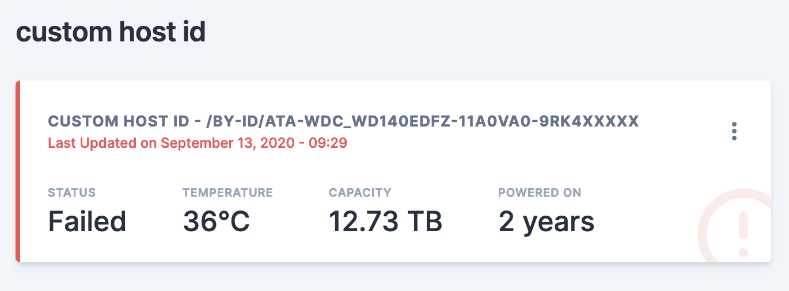

# Scrutiny <-> SmartMonTools 

Scrutiny uses `smartctl --scan` to detect devices/drives. If your devices are not being detected by Scrutiny, or some 
data is missing, this is probably due to a `smartctl` issue. 
The following page will document commonly asked questions and troubleshooting steps for the Scrutiny S.M.A.R.T. data collector.

## WWN vs Device name
As discussed in [`#117`](https://github.com/AnalogJ/scrutiny/issues/117), `/dev/sd*` device paths are ephemeral. 

> Device paths in Linux aren't guaranteed to be consistent across restarts. Device names consist of major numbers (letters) and minor numbers. When the Linux storage device driver detects a new device, the driver assigns major and minor numbers from the available range to the device. When a device is removed, the device numbers are freed for reuse.
>
> The problem occurs because device scanning in Linux is scheduled by the SCSI subsystem to happen asynchronously. As a result, a device path name can vary across restarts.
>
> https://docs.microsoft.com/en-us/troubleshoot/azure/virtual-machines/troubleshoot-device-names-problems

While the Docker Scrutiny collector does require devices to attached to the docker container by device name (using `--device=/dev/sd..`), internally 
Scrutiny stores and references the devices by their `WWN` which is globally unique, and never changes. 

As such, passing devices to the Scrutiny collector container using `/dev/disk/by-id/`, `/dev/disk/by-label/`, `/dev/disk/by-path/` and `/dev/disk/by-uuid/`
paths are unnecessary, unless you'd like to ensure the docker run command never needs to change.

#### Force /dev/disk/by-id paths

Since Scrutiny uses WWN under the hood, it really doesn't care about `/dev/sd*` vs `/dev/disk/by-id/`. The problem is the interaction between docker and smartmontools when using `--device /dev/disk/by-id` paths. 

Basically Scrutiny offloads all device detection to smartmontools, which doesn't seem to detect devices that have been passed into the docker container using `/dev/disk/by-id` paths.

If you must use "static" device references, you can map the host device id/uuid/wwn references to device names within the container:

```
# --device=<Host Device>:<Container Device Mapping>

docker run ....
--device=/dev/disk/by-id/wwn-0x5000xxxxx:/dev/sda
--device=/dev/disk/by-id/wwn-0x5001xxxxx:/dev/sdb
--device=/dev/disk/by-id/wwn-0x5003xxxxx:/dev/sdc
...
```


## Device Detection By Smartctl

The first thing you'll want to do is run `smartctl` locally (not in Docker) and make sure the output shows all your drives as expected.
See the `Drive Types` section below for what this output should look like for `NVMe`/`ATA`/`RAID` drives.

```bash
smartctl --scan

/dev/sda -d scsi # /dev/sda, SCSI device
/dev/sdb -d scsi # /dev/sdb, SCSI device
/dev/sdc -d scsi # /dev/sdc, SCSI device
/dev/sdd -d scsi # /dev/sdd, SCSI device
```

Once you've verified that `smartctl` correctly detects your drives, make sure scrutiny is correctly detecting them as well.
> NOTE: make sure you specify all the devices you'd like scrutiny to process using `--device=` flags.

```bash
docker run -it --rm \
  -v /run/udev:/run/udev:ro \
  --cap-add SYS_RAWIO \
  --device=/dev/sda \
  --device=/dev/sdb \
  ghcr.io/Starosdev/scrutiny:master-collector smartctl --scan
```

If the output is the same, your devices will be processed by Scrutiny.

### Collector Config File
In some cases `--scan` does not correctly detect the device type, returning [incomplete SMART data](https://github.com/AnalogJ/scrutiny/issues/45).
Scrutiny will supports overriding the detected device type via the config file.

[example.collector.yaml](https://github.com/AnalogJ/scrutiny/blob/master/example.collector.yaml)

### RAID Controllers (Megaraid/3ware/HBA/Adaptec/HPE/etc)
Smartctl has support for a large number of [RAID controllers](https://www.smartmontools.org/wiki/Supported_RAID-Controllers), however this 
support is not automatic, and may require some additional device type hinting. You can provide this information to the Scrutiny collector
using a collector config file. See [example.collector.yaml](/example.collector.yaml)

> NOTE: If you use docker, you **must** pass though the RAID virtual disk to the container using `--device` (see below)
>
> This device may be in `/dev/*` or `/dev/bus/*`.
> If you do not see a virtual device file `/dev/bus/*` you may need to use the `--privileged` flag. See [#366 for more info](https://github.com/AnalogJ/scrutiny/issues/366#issuecomment-1253196407)
>
> If you're unsure, run `smartctl --scan` on your host, and pass all listed devices to the container.

```yaml
# /opt/scrutiny/config/collector.yaml
devices:
  # Dell PERC/Broadcom Megaraid example: https://github.com/AnalogJ/scrutiny/issues/30
  - device: /dev/bus/0
    type:
      - megaraid,14
      - megaraid,15
      - megaraid,18
      - megaraid,19
      - megaraid,20
      - megaraid,21

  - device: /dev/twa0
    type:
      - 3ware,0
      - 3ware,1
      - 3ware,2
      - 3ware,3
      - 3ware,4
      - 3ware,5
  
  # Adapec RAID: https://github.com/AnalogJ/scrutiny/issues/189
  - device: /dev/sdb
    type:
      - aacraid,0,0,0
      - aacraid,0,0,1

  # HPE Smart Array example:  https://github.com/AnalogJ/scrutiny/issues/213
  - device: /dev/sda
    type:
      - 'cciss,0'
      - 'cciss,1'
```

>

### NVMe Drives

As mentioned in the [README.md](/README.md), NVMe devices require both `--cap-add SYS_RAWIO` and `--cap-add SYS_ADMIN`
to allow smartctl permission to query your NVMe device SMART data [#26](https://github.com/AnalogJ/scrutiny/issues/26)

When attaching NVMe devices using `--device=/dev/nvme..`, make sure to provide the device controller (`/dev/nvme0`)
instead of the block device (`/dev/nvme0n1`). See [#209](https://github.com/AnalogJ/scrutiny/issues/209).

> The character device /dev/nvme0 is the NVME device controller, and block devices like /dev/nvme0n1 are the NVME storage namespaces: the devices you use for actual storage, which will behave essentially as disks.
>
> In enterprise-grade hardware, there might be support for several namespaces, thin provisioning within namespaces and other features. For now, you could think namespaces as sort of meta-partitions with extra features for enterprise use.

### ATA

### USB Devices

The following information is extracted from [#266](https://github.com/AnalogJ/scrutiny/issues/266)

External HDDs support two modes of operation usb-storage (old, slower, stable) and uas (new, faster, sometimes unstable)
. On some external HDDs, uas mode does not properly pass through SMART information, or even causes hardware issues, so
it has been disabled by the kernel. No amount of smartctl parameters will fix this, as it is being rejected by the
kernel. This is especially true with Seagate HDDs. One solution is to force these devices into usb-storage mode, which
will incur some performance penalty, but may work well enough for you. More info:

- https://smartmontools.org/wiki/Supported_USB-Devices
- https://smartmontools.org/wiki/SAT-with-UAS-Linux
- https://forums.raspberrypi.com/viewtopic.php?t=245931

### Exit Codes

If you see an error message similar to `smartctl returned an error code (2) while processing /dev/sda`, this means that
`smartctl` (not Scrutiny) exited with an error code. Scrutiny will attempt to print a helpful error message to help you
debug, but you can look at the table (and associated links) below to debug `smartctl`.

> smartctl Return Values
> The return values of smartctl are defined by a bitmask. If all is well with the disk, the return value (exit status) of
> smartctl is 0 (all bits turned off). If a problem occurs, or an error, potential error, or fault is detected, then
> a non-zero status is returned. In this case, the eight different bits in the return value have the following meanings 
> for ATA disks; some of these values may also be returned for SCSI disks.
> 
> source: http://www.linuxguide.it/command_line/linux-manpage/do.php?file=smartctl#sect7


| Exit Code (Isolated) | Binary | Problem Message |
| --- | --- | --- |
| 1 | Bit 0 | Command line did not parse. |
| 2 | Bit 1 | Device open failed, or device did not return an IDENTIFY DEVICE structure. |
| 4 | Bit 2 | Some SMART command to the disk failed, or there was a checksum error in a SMART data structure (see В´-bВ´ option above). |
| 8 | Bit 3 | SMART status check returned “DISK FAILING". |
| 16 | Bit 4 | We found prefail Attributes <= threshold. |
| 32 | Bit 5 | SMART status check returned “DISK OK” but we found that some (usage or prefail) Attributes have been <= threshold at some time in the past. |
| 64 | Bit 6 | The device error log contains records of errors. |
| 128 | Bit 7 | The device self-test log contains records of errors. |

#### Standby/Sleeping Disks

Disks in Standby/Sleep can also cause `smartctl` to exit abnormally, usually with `exit code: 2`. 

- https://github.com/AnalogJ/scrutiny/issues/221
- https://github.com/AnalogJ/scrutiny/issues/157

### Volume Mount All Devices (`/dev`) - Privileged

> WARNING: This is an insecure/dangerous workaround. Running Scrutiny (or any Docker image) with `--privileged` is equivalent to running it with root access. 

If you have exhausted all other mechanisms to get your disks working with `smartctl` running within a container, you can try running the docker image with the following additional flags:

- `--privileged` (instead of `--cap-add`) - this gives the docker container full access to your system. Scrutiny does not require this permission, however it can be helpful for `smartctl`
- `-v /dev:/dev:ro` (instead of `--device`) - this mounts the `/dev` folder (containing all your device files) into the container, allowing `smartctl` to see your disks, exactly as if it were running on your host directly. 

With this workaround your `docker run` command would look similar to the following:

```bash
docker run -it --rm -p 8080:8080 -p 8086:8086 \
  -v `pwd`/scrutiny:/opt/scrutiny/config \
  -v `pwd`/influxdb2:/opt/scrutiny/influxdb \
  -v /run/udev:/run/udev:ro \
  --privileged \
  -v /dev:/dev \
  --name scrutiny \
  ghcr.io/Starosdev/scrutiny:master-omnibus
```

## Scrutiny detects Failure but SMART Passed?

There's 2 different mechanisms that Scrutiny uses to detect failures.

The first is simple SMART failures. If SMART thinks an attribute is in a failed state, Scrutiny will display it as failed as well.

The second is using BackBlaze failure data: [https://backblaze.com/blog-smart-stats-2014-8.html](https://backblaze.com/blog-smart-stats-2014-8.html) 
If Scrutiny detects that an attribute corresponds with a high rate of failure using BackBlaze's data, it will also mark that attribute (and disk) as failed (even though SMART may think the device is still healthy).

This can cause some confusion when comparing Scrutiny's dashboard against other SMART analysis tools. 
If you hover over the "failed" label beside an attribute, Scrutiny will tell you if the failure was due to SMART or Scrutiny/BackBlaze data. 

### Device failed but Smart & Scrutiny passed

Device SMART results are the source of truth for Scrutiny, however we don't just take into account the current SMART results, but also historical analysis of a disk.
This means that if a device is marked as failed at any point in its history, it will continue to be stored in the database as failed until the device is removed (or status is reset -- see below).

In some cases, this historical failure may have been due to attribute analysis/thresholds that have since been relaxed:

- NVME - Numb Error Log Entries (v0.4.7)
- ATA - Power Cycle Count (v0.4.7)
- ATA - Read Error Rate (v0.4.13)
- ATA - Seek Error Rate (v0.4.13)

If you'd like to reset the status of a disk (to healthy) and allow the next run of the collector to determine the actual status, you can run the following command:

```bash
# connect to scrutiny docker container
docker exec -it scrutiny bash

# install sqlite CLI tools (inside container)
apt update && apt install -y sqlite3

# connect to the scrutiny database
sqlite3 /opt/scrutiny/config/scrutiny.db

# reset/update the devices table, unset the failure status. 
UPDATE devices SET device_status = null;

# exit sqlite CLI
.exit
```

### Seagate Drives Failing

As thoroughly discussed in [#255](https://github.com/AnalogJ/scrutiny/issues/255) and [#522](https://github.com/AnalogJ/scrutiny/issues/522), Seagate (Ironwolf & others) drives are almost always marked as failed by Scrutiny. 

#### Seek Error Rate & Read Error Rate (#255)
> The `Seek Error Rate` & `Read Error Rate` attribute raw values are typically very high, and the 
> normalised values (Current / Worst / Threshold) are usually quite low. Despite this, the numbers in most cases are perfectly OK
> 
> The anxiety arises because we intuitively expect that the normalised values should reflect a "health" score, with 
> 100 being the ideal value. Similarly, we would expect that the raw values should reflect an error count, in 
> which case a value of 0 would be most desirable. However, Seagate calculates and applies these attribute values 
> in a counterintuitive way.
> 
> http://www.users.on.net/~fzabkar/HDD/Seagate_SER_RRER_HEC.html

Some analysis has been done which shows that Seagate drives break the common SMART conventions, which also causes Scrutiny's
comparison against BackBlaze data to detect these drives as failed. 

**So what's the Solution?**

After taking a look at the BackBlaze data for the relevant Attributes (`Seek Error Rate` & `Read Error Rate`), I've decided
to disable Scrutiny analysis for them. Both are non-critical, and have low-correlation with failure.

> Please note: SMART failures for these attributes will still cause the drive to be marked as failed. Only BackBlaze analysis has been disabled

If this is effecting your drives, you'll need to do the following:

1. Upgrade to v0.4.13+
2. Reset your drive status using the SQLite script
   in [#device-failed-but-smart--scrutiny-passed](https://github.com/AnalogJ/scrutiny/blob/master/docs/TROUBLESHOOTING_DEVICE_COLLECTOR.md#device-failed-but-smart--scrutiny-passed)
3. Wait for (or manually start) the collector.

If you'd like to learn more about how the Seagate Ironwolf SMART attributes work under the hood, and how they differ
from
other drives, please read the following:

- http://www.users.on.net/~fzabkar/HDD/Seagate_SER_RRER_HEC.html
- https://www.truenas.com/community/threads/seagate-ironwolf-smart-test-raw_read_error_rate-seek_error_rate.68634/

#### Seagate Raw Values are incorrect (#522)
Basically Seagate drives are known to use a custom data format for a number of their SMART attributes. This causes issues with Scrutiny's threshold analysis. 

- The workaround is to customize the smartctl command that Scrutiny uses for your drive by [creating a collector.yaml file](https://github.com/AnalogJ/scrutiny/issues/522#issuecomment-1766727988) and "fixing" each attribute
- The **real "fix"** is to make sure your Seagate drive is correctly supported by smartmontools. See this [PR](https://github.com/smartmontools/smartmontools/pull/247)

Sorry for the bad news, but this is a known issue and there's just not much we can do on the Scrutiny side. 


## Hub & Spoke model, with multiple Hosts.



When deploying Scrutiny in a hub & spoke model, it can be difficult to determine exactly which node a set of devices are
associated with.
Thankfully the collector has a special `--host-id` flag (or `COLLECTOR_HOST_ID` env variable) that can be used to
associate devices with a friendly host name.

The host-id is passed from the collector to the web-api when SMART device data is uploaded. There's 3 ways you can set
the host-id:

- using the collector config
  file: [master/example.collector.yaml#L19-L22](https://github.com/AnalogJ/scrutiny/blob/master/example.collector.yaml?rgh-link-date=2022-05-25T15%3A08%3A56Z#L19-L22)
- using the `--host-id` collector CLI
  argument: [master/collector/cmd/collector-metrics/collector-metrics.go#L180-L185](https://github.com/AnalogJ/scrutiny/blob/master/collector/cmd/collector-metrics/collector-metrics.go?rgh-link-date=2022-05-25T15%3A08%3A56Z#L180-L185)
- using the `COLLECTOR_HOST_ID` environmental variable.

See the [docs/INSTALL_HUB_SPOKE.md](/docs/INSTALL_HUB_SPOKE.md) guide for more information.

## Collector DEBUG mode

You can use environmental variables to enable debug logging and/or log files for the collector:

```bash
DEBUG=true
COLLECTOR_LOG_FILE=/tmp/collector.log
```

Or if you're not using docker, you can pass CLI arguments to the collector during startup:

```bash
scrutiny-collector-metrics run --debug --log-file /tmp/collector.log
```

## Collector trigger on startup

When the `omnibus` docker image starts up, it will automatically trigger the collector, which will populate the Scrutiny
Webui with your disks.
This is not the case when running the collector docker image in **hub/spoke** mode, as the collector and webui are
running in different containers (and potentially different host machines), so
the web container may not be ready for incoming connections. By default the container will only run the collector at the
time specified in the cron schedule.

You can force the collector to run on startup using the following env variables:

- `-e COLLECTOR_RUN_STARTUP=true` - forces the collector to run on startup (cron will be started after the collector
  completes)
- `-e COLLECTOR_RUN_STARTUP_SLEEP=10` - if `COLLECTOR_RUN_STARTUP` is enabled, you can use this env variable to
  configure the delay before the collector is run (default: `1` second). Used to ensure the web container has started
  successfully.  
